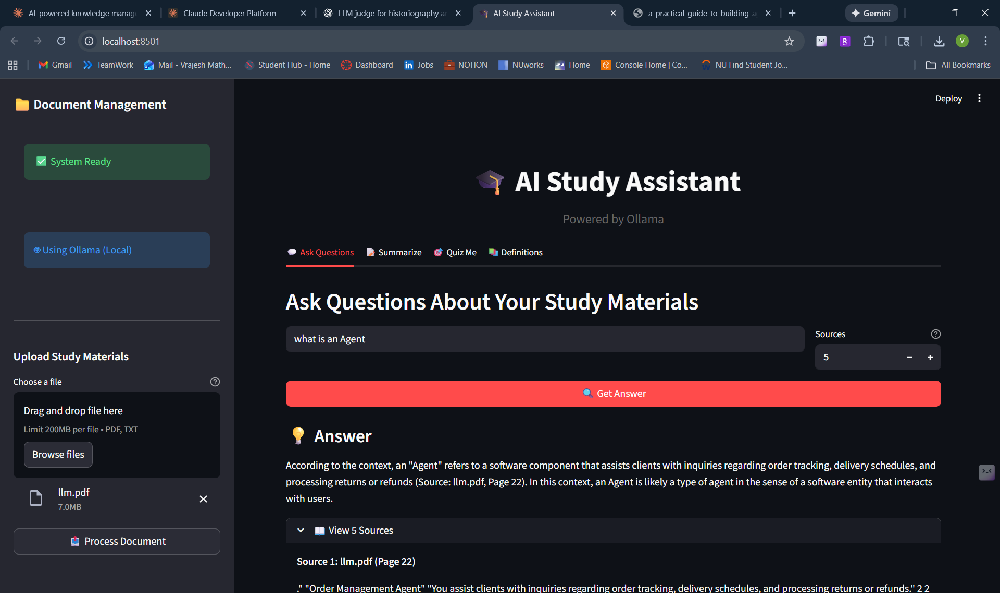

# AI Study Assistant

Turn your study materials into an intelligent learning companion with Retrieval-Augmented Generation (RAG) running on local LLMs. Upload textbooks or notes, then ask questions, generate summaries, build quizzes, and extract definitions, all with source citations back to your documents.


## Why this project

- **Private by design.** Everything runs locally through Ollama. Documents never leave your machine, no API keys, no per-token costs.
- **Grounded answers.** Every answer cites the source document and page it came from, so you can verify instead of trust.
- **Full learning loop.** Q&A, multi-format summaries, auto-generated quizzes with grading, and definition extraction in one place.
- **Real API.** A documented FastAPI backend (Swagger at `/docs`) powers both the Streamlit UI and any client you build.

## Demo



> The app needs Ollama running locally (see Quick Start). It is a local-first project by design.

## Features

| Capability | Details |
|---|---|
| Document ingestion | PDF and TXT upload with page-aware chunking (1000 chars, 200 overlap) |
| Semantic search | Chroma vector store with Ollama embeddings (`nomic-embed-text`) |
| RAG Q&A | Context-grounded answers with per-answer source citations |
| Summaries | Bullets, short, detailed, and ELI5 formats, topic-scoped or general |
| Quiz generation | Multiple-choice quizzes, 1-10 questions, easy/medium/hard |
| Auto-grading | Instant scoring with per-question explanations |
| Definitions | Key-term extraction for glossaries and flashcards |
| REST API | Validated FastAPI endpoints, CORS-enabled, Swagger docs |
| Health checks | `/health` reports API status and Ollama connectivity |

## Architecture

```
Streamlit UI  --->  FastAPI  --->  RAG pipeline  --->  Ollama (local)
                                   |-- ingestion -> ChromaDB
                                   |-- Q&A / summaries / definitions
                                   |-- quiz generation + grading
```

**Stack:** LangChain, ChromaDB, Ollama (`llama3.2` + `nomic-embed-text`), FastAPI, Streamlit, PyPDF.

## Quick Start

### Prerequisites

- Python 3.11+
- [Ollama](https://ollama.ai/download) with models pulled:
  ```bash
  ollama pull llama3.2
  ollama pull nomic-embed-text
  ```

### Install

```bash
git clone https://github.com/Vrajesh-works/ai-study-assistant.git
cd ai-study-assistant
python -m venv venv && source venv/bin/activate   # Windows: venv\Scripts\activate
pip install -r requirements.txt
cp .env.example .env   # optional, defaults work out of the box
```

### Run

Terminal 1, API:
```bash
python api/main.py
# API docs: http://localhost:8000/docs
```

Terminal 2, UI:
```bash
streamlit run frontend/app.py
# UI: http://localhost:8501
```

Then upload a PDF/TXT in the sidebar and start asking questions.

## Configuration

All settings live in `.env` (see `.env.example`) and are loaded at startup:

| Variable | Default | Purpose |
|---|---|---|
| `OLLAMA_BASE_URL` | `http://localhost:11434` | Ollama server address |
| `OLLAMA_MODEL` | `llama3.2` | Chat model (`llama3.1`, `mistral`, `phi` also work) |
| `OLLAMA_EMBEDDING_MODEL` | `nomic-embed-text` | Embedding model |
| `API_HOST` / `API_PORT` | `0.0.0.0` / `8000` | API bind address |

## API Reference

| Method | Endpoint | Description |
|---|---|---|
| GET | `/` | Service status and endpoint index |
| GET | `/health` | Health check incl. Ollama connectivity |
| POST | `/upload` | Upload and index a PDF/TXT file |
| POST | `/ask` | Ask a question (`question`, `k`) |
| POST | `/summarize` | Summarize (`topic`, `summary_type`, `k`) |
| POST | `/definitions` | Extract definitions (`topic`, `k`) |
| POST | `/quiz/generate` | Generate quiz (`topic`, `num_questions` 1-10, `difficulty`) |
| POST | `/quiz/grade` | Grade a quiz (`questions`, `user_answers`) |
| GET | `/documents` | List uploaded documents |
| DELETE | `/reset` | Clear uploads and the vector store |

Full interactive docs at `http://localhost:8000/docs` when the API is running.

## Project Structure

```
ai-study-assistant/
├── api/
│   └── main.py            # FastAPI app (lazy init, validated schemas)
├── frontend/
│   └── app.py             # Streamlit UI
├── src/
│   ├── config.py          # Env-driven configuration
│   ├── ingestion.py       # PDF/TXT extraction, chunking, Chroma indexing
│   ├── rag.py             # Q&A, summarization, definition extraction
│   ├── quiz_generator.py  # Quiz generation + grading
│   └── prompts.py         # Prompt templates
├── data/
│   ├── uploads/           # Uploaded study materials (gitignored at runtime)
│   └── vector_store/      # Chroma persistence (gitignored, rebuilt on demand)
├── tests/                 # Pytest suite (no Ollama required)
├── docs/images/           # Screenshots
├── .github/workflows/     # CI: pytest + ruff
├── requirements.txt       # Pinned dependencies
└── .env.example           # Configuration template
```

## Testing

Unit tests run without Ollama (LLM calls are not exercised):

```bash
pip install pytest httpx
pytest tests/test_quiz.py tests/test_config.py tests/test_api.py -v
```

The end-to-end pipeline script (requires Ollama running):

```bash
python tests/test_system.py
```

It ingests a sample document, then exercises Q&A, summarization, definitions, quiz generation, and grading.

## Troubleshooting

**Ollama connection failed.** Check `ollama list` shows your models and `ollama serve` is running. Verify with `curl http://localhost:11434/api/tags`.

**API shows "No module named 'src'".** Run from the project root: `cd ai-study-assistant && python api/main.py`.

**Streamlit shows "API not reachable".** Start the API first and confirm `http://localhost:8000/health` returns `"status": "ok"`.

**Quiz generation returns invalid JSON.** Reduce to 3-5 questions, try `easy` difficulty, or use a more capable model.

**Slow responses.** First runs build the embedding index. Smaller models (`phi`) and fewer retrieved chunks (`k`) speed things up.

## License

MIT. See [LICENSE](LICENSE).
